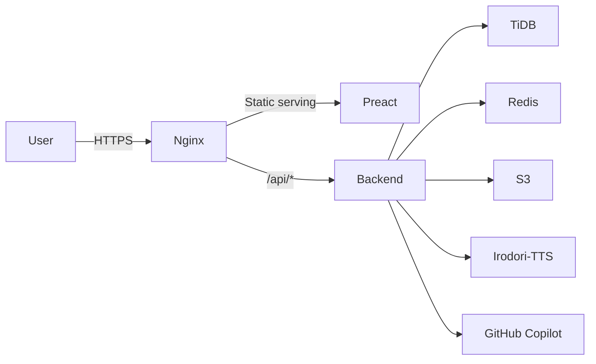

# kioku

[日本語](README.md)

## Architecture



Voice generation uses [Irodori-TTS-Server](https://github.com/Aratako/Irodori-TTS-Server). For the GPU (Azure Container Apps) build configuration, see `irodori/`.

## Setup

We recommend opening the project with VSCode Devcontainer.

Copy `.devcontainer/.env.example` to create `.devcontainer/.env`, then set each value.

| Variable | Description |
| --- | --- |
| `PORT` | Backend port |
| `FRONTEND_URL` | Frontend URL |
| `BACKEND_URL` | Backend URL |
| `DATABASE_URL` | TiDB connection URL |
| `MYSQL_KIND` | `mariadb` or `tidb` |
| `REDIS_URL` | Redis connection URL |
| `GOOGLE_OIDC_CLIENT_ID` |  |
| `GOOGLE_OIDC_CLIENT_SECRET` |  |
| `S3_ENDPOINT_URL` | S3 endpoint |
| `S3_REGION` | S3 region |
| `S3_ACCESS_KEY_ID` | S3 access key |
| `S3_SECRET_ACCESS_KEY` | S3 secret key |
| `S3_PROVIDER_NAME` | S3 provider name |
| `S3_BUCKET` | Bucket for file storage |
| `S3_TEMPORARY_BUCKET` | Bucket for temporary files |
| `IRODORI_URL` | Irodori-TTS-Server endpoint |
| `GITHUB_TOKEN` | Token for the GitHub Copilot API |
| `OTEL_EXPORTER_OTLP_ENDPOINT` | OpenTelemetry exporter endpoint |
| `OTEL_EXPORTER_OTLP_PROTOCOL` | OpenTelemetry protocol |

Generate the JWT key files in `.devcontainer/`.

```sh
# Private key
openssl genpkey -algorithm Ed25519 -out .devcontainer/jwt_private.pem

# Public key
openssl pkey -in .devcontainer/jwt_private.pem -pubout -out .devcontainer/jwt_public.pem
```

Generate a self-signed certificate for Nginx in `.devcontainer/nginx/`.

```sh
openssl req -x509 -newkey ec -pkeyopt ec_paramgen_curve:prime256v1 -nodes \
  -keyout .devcontainer/nginx/server.key -out .devcontainer/nginx/server.crt \
  -days 365 -subj '/CN=localhost'
```

After opening the devcontainer, start the development servers with the following commands.

Backend:

```sh
cd backend
cargo run
```

Frontend:

```sh
cd frontend
npm i
npm run dev
```

## API Definition

The OpenAPI definition is in [shared/api/openapi.yaml](shared/api/openapi.yaml).
The backend generates OpenAPI with utoipa, and the frontend generates client code using orval.
After starting the backend server, you can view the API definition graphically at `/redoc`.

## DB Definition

The DB definition is in [backend/docs/schema](backend/docs/schema/).
It is generated using tbls.
