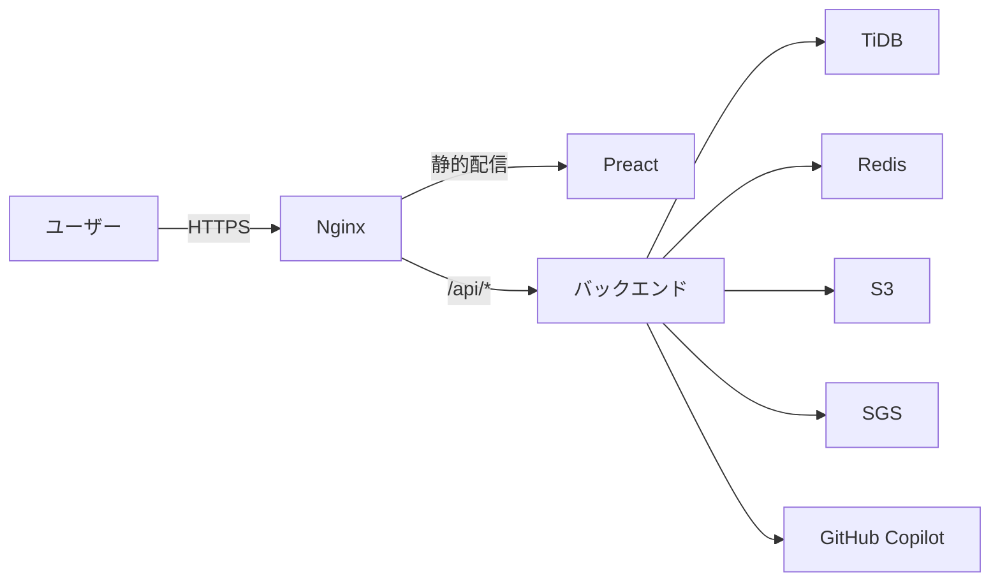

# kioku

## アーキテクチャ



SGSについては[brqnko/speech-generation-server](https://github.com/brqnko/speech-generation-server)を参照してください。

## 環境構築

VSCodeのDevcontainerを使って開くことをおすすめします。

`.devcontainer/.env.example`をコピーして`.devcontainer/.env`を作成し、各値を設定してください。

| 変数名 | 説明 |
| --- | --- |
| `PORT` | バックエンドのポート |
| `FRONTEND_URL` | フロントエンドのURL |
| `BACKEND_URL` | バックエンドのURL |
| `DATABASE_URL` | TiDB接続URL |
| `MYSQL_KIND` | `mariadb`または`tidb` |
| `REDIS_URL` | Redis接続URL |
| `GOOGLE_OIDC_CLIENT_ID` |  |
| `GOOGLE_OIDC_CLIENT_SECRET` |  |
| `S3_ENDPOINT_URL` | S3エンドポイント |
| `S3_REGION` | S3リージョン |
| `S3_ACCESS_KEY_ID` | S3アクセスキー |
| `S3_SECRET_ACCESS_KEY` | S3シークレットキー |
| `S3_PROVIDER_NAME` | S3プロバイダー名 |
| `S3_BUCKET` | ファイル保存用バケット |
| `S3_TEMPORARY_BUCKET` | 一時ファイル用バケット |
| `SGI_URL` | SGSのエンドポイント |
| `SGI_TOKEN` | SGSの認証トークン |
| `GITHUB_TOKEN` | GitHub Copilot API用トークン |
| `OTEL_EXPORTER_OTLP_ENDPOINT` | OpenTelemetryエクスポーターのエンドポイント |
| `OTEL_EXPORTER_OTLP_PROTOCOL` | OpenTelemetryプロトコル |

JWT用の鍵ファイルを`.devcontainer/`に生成してください。

```sh
# 秘密鍵
openssl genpkey -algorithm Ed25519 -out .devcontainer/jwt_private.pem

# 公開鍵
openssl pkey -in .devcontainer/jwt_private.pem -pubout -out .devcontainer/jwt_public.pem
```

Nginx用の自己署名証明書を`.devcontainer/nginx/`に生成してください。

```sh
openssl req -x509 -newkey ec -pkeyopt ec_paramgen_curve:prime256v1 -nodes \
  -keyout .devcontainer/nginx/server.key -out .devcontainer/nginx/server.crt \
  -days 365 -subj '/CN=localhost'
```

devcontainerを開いた後、以下のコマンドで開発サーバーを起動します。

バックエンド:

```sh
cd backend
cargo run
```

フロントエンド:

```sh
cd frontend
npm i
npm run dev
```

## API定義

[shared/api/openapi.yaml](shared/api/openapi.yaml)にOpenAPI定義があります。
BackendはutoipaでOpenAPIを生成し、Frontendはorvalを使ってクライアントコードを生成します。
バックエンドサーバー起動後、`/redoc`からAPI定義をグラフィカルに確認できます。

## DB定義

[backend/docs/schema](backend/docs/schema/)にDB定義があります。
tblsを用いて生成しています。
