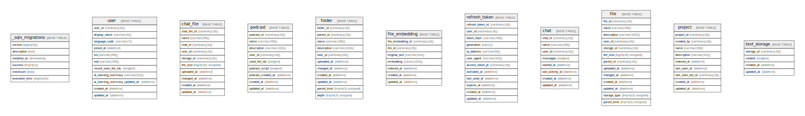

# kioku

## Tables

| Name | Columns | Comment | Type |
| ---- | ------- | ------- | ---- |
| [_sqlx_migrations](_sqlx_migrations.md) | 6 |  | BASE TABLE |
| [user](user.md) | 11 |  | BASE TABLE |
| [chat_file](chat_file.md) | 10 |  | BASE TABLE |
| [podcast](podcast.md) | 11 |  | BASE TABLE |
| [folder](folder.md) | 11 |  | BASE TABLE |
| [file_embedding](file_embedding.md) | 7 |  | BASE TABLE |
| [refresh_token](refresh_token.md) | 12 |  | BASE TABLE |
| [chat](chat.md) | 8 |  | BASE TABLE |
| [file](file.md) | 13 |  | BASE TABLE |
| [project](project.md) | 9 |  | BASE TABLE |
| [text_storage](text_storage.md) | 4 |  | BASE TABLE |

## Relations

---

> Generated by [tbls](https://github.com/k1LoW/tbls)
