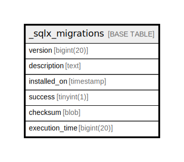

# _sqlx_migrations

## Description

<details>
<summary><strong>Table Definition</strong></summary>

```sql
CREATE TABLE `_sqlx_migrations` (
  `version` bigint(20) NOT NULL,
  `description` text NOT NULL,
  `installed_on` timestamp NOT NULL DEFAULT current_timestamp(),
  `success` tinyint(1) NOT NULL,
  `checksum` blob NOT NULL,
  `execution_time` bigint(20) NOT NULL,
  PRIMARY KEY (`version`)
) ENGINE=InnoDB DEFAULT CHARSET=utf8mb4 COLLATE=utf8mb4_uca1400_ai_ci
```

</details>

## Columns

| Name | Type | Default | Nullable | Children | Parents | Comment |
| ---- | ---- | ------- | -------- | -------- | ------- | ------- |
| version | bigint(20) |  | false |  |  |  |
| description | text |  | false |  |  |  |
| installed_on | timestamp | current_timestamp() | false |  |  |  |
| success | tinyint(1) |  | false |  |  |  |
| checksum | blob |  | false |  |  |  |
| execution_time | bigint(20) |  | false |  |  |  |

## Constraints

| Name | Type | Definition |
| ---- | ---- | ---------- |
| PRIMARY | PRIMARY KEY | PRIMARY KEY (version) |

## Indexes

| Name | Definition |
| ---- | ---------- |
| PRIMARY | PRIMARY KEY (version) USING BTREE |

## Relations



---

> Generated by [tbls](https://github.com/k1LoW/tbls)
