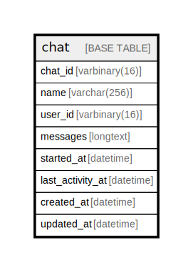

# chat

## Description

<details>
<summary><strong>Table Definition</strong></summary>

```sql
CREATE TABLE `chat` (
  `chat_id` varbinary(16) NOT NULL,
  `name` varchar(256) NOT NULL,
  `user_id` varbinary(16) NOT NULL,
  `messages` longtext CHARACTER SET utf8mb4 COLLATE utf8mb4_bin NOT NULL CHECK (json_valid(`messages`)),
  `started_at` datetime NOT NULL,
  `last_activity_at` datetime NOT NULL,
  `created_at` datetime NOT NULL DEFAULT current_timestamp(),
  `updated_at` datetime NOT NULL DEFAULT current_timestamp() ON UPDATE current_timestamp(),
  PRIMARY KEY (`chat_id`)
) ENGINE=InnoDB DEFAULT CHARSET=utf8mb4 COLLATE=utf8mb4_uca1400_ai_ci
```

</details>

## Columns

| Name | Type | Default | Nullable | Extra Definition | Children | Parents | Comment |
| ---- | ---- | ------- | -------- | ---------------- | -------- | ------- | ------- |
| chat_id | varbinary(16) |  | false |  |  |  |  |
| name | varchar(256) |  | false |  |  |  |  |
| user_id | varbinary(16) |  | false |  |  |  |  |
| messages | longtext |  | false |  |  |  |  |
| started_at | datetime |  | false |  |  |  |  |
| last_activity_at | datetime |  | false |  |  |  |  |
| created_at | datetime | current_timestamp() | false |  |  |  |  |
| updated_at | datetime | current_timestamp() | false | on update current_timestamp() |  |  |  |

## Constraints

| Name | Type | Definition |
| ---- | ---- | ---------- |
| PRIMARY | PRIMARY KEY | PRIMARY KEY (chat_id) |
| messages | CHECK | CHECK (json_valid(`messages`)) |

## Indexes

| Name | Definition |
| ---- | ---------- |
| PRIMARY | PRIMARY KEY (chat_id) USING BTREE |

## Relations



---

> Generated by [tbls](https://github.com/k1LoW/tbls)
