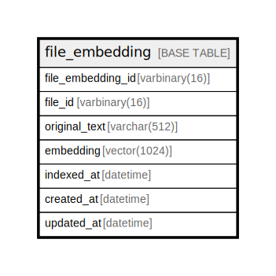

# file_embedding

## Description

<details>
<summary><strong>Table Definition</strong></summary>

```sql
CREATE TABLE `file_embedding` (
  `file_embedding_id` varbinary(16) NOT NULL,
  `file_id` varbinary(16) NOT NULL,
  `original_text` varchar(512) NOT NULL,
  `embedding` vector(1024) NOT NULL,
  `indexed_at` datetime NOT NULL,
  `created_at` datetime NOT NULL DEFAULT current_timestamp(),
  `updated_at` datetime NOT NULL DEFAULT current_timestamp() ON UPDATE current_timestamp(),
  PRIMARY KEY (`file_embedding_id`),
  KEY `idx_file_id` (`file_id`)
) ENGINE=InnoDB DEFAULT CHARSET=utf8mb4 COLLATE=utf8mb4_uca1400_ai_ci
```

</details>

## Columns

| Name | Type | Default | Nullable | Extra Definition | Children | Parents | Comment |
| ---- | ---- | ------- | -------- | ---------------- | -------- | ------- | ------- |
| file_embedding_id | varbinary(16) |  | false |  |  |  |  |
| file_id | varbinary(16) |  | false |  |  |  |  |
| original_text | varchar(512) |  | false |  |  |  |  |
| embedding | vector(1024) |  | false |  |  |  |  |
| indexed_at | datetime |  | false |  |  |  |  |
| created_at | datetime | current_timestamp() | false |  |  |  |  |
| updated_at | datetime | current_timestamp() | false | on update current_timestamp() |  |  |  |

## Constraints

| Name | Type | Definition |
| ---- | ---- | ---------- |
| PRIMARY | PRIMARY KEY | PRIMARY KEY (file_embedding_id) |

## Indexes

| Name | Definition |
| ---- | ---------- |
| idx_file_id | KEY idx_file_id (file_id) USING BTREE |
| PRIMARY | PRIMARY KEY (file_embedding_id) USING BTREE |

## Relations



---

> Generated by [tbls](https://github.com/k1LoW/tbls)
