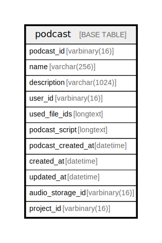

# podcast

## Description

<details>
<summary><strong>Table Definition</strong></summary>

```sql
CREATE TABLE `podcast` (
  `podcast_id` varbinary(16) NOT NULL,
  `name` varchar(256) NOT NULL,
  `description` varchar(1024) NOT NULL,
  `user_id` varbinary(16) NOT NULL,
  `used_file_ids` longtext CHARACTER SET utf8mb4 COLLATE utf8mb4_bin NOT NULL CHECK (json_valid(`used_file_ids`)),
  `podcast_script` longtext CHARACTER SET utf8mb4 COLLATE utf8mb4_bin NOT NULL CHECK (json_valid(`podcast_script`)),
  `podcast_created_at` datetime NOT NULL,
  `created_at` datetime NOT NULL DEFAULT current_timestamp(),
  `updated_at` datetime NOT NULL DEFAULT current_timestamp() ON UPDATE current_timestamp(),
  `audio_storage_id` varbinary(16) NOT NULL,
  `project_id` varbinary(16) NOT NULL,
  PRIMARY KEY (`podcast_id`),
  KEY `idx_project_created_at` (`project_id`,`podcast_created_at`,`podcast_id`)
) ENGINE=InnoDB DEFAULT CHARSET=utf8mb4 COLLATE=utf8mb4_uca1400_ai_ci
```

</details>

## Columns

| Name | Type | Default | Nullable | Extra Definition | Children | Parents | Comment |
| ---- | ---- | ------- | -------- | ---------------- | -------- | ------- | ------- |
| podcast_id | varbinary(16) |  | false |  |  |  |  |
| name | varchar(256) |  | false |  |  |  |  |
| description | varchar(1024) |  | false |  |  |  |  |
| user_id | varbinary(16) |  | false |  |  |  |  |
| used_file_ids | longtext |  | false |  |  |  |  |
| podcast_script | longtext |  | false |  |  |  |  |
| podcast_created_at | datetime |  | false |  |  |  |  |
| created_at | datetime | current_timestamp() | false |  |  |  |  |
| updated_at | datetime | current_timestamp() | false | on update current_timestamp() |  |  |  |
| audio_storage_id | varbinary(16) |  | false |  |  |  |  |
| project_id | varbinary(16) |  | false |  |  |  |  |

## Constraints

| Name | Type | Definition |
| ---- | ---- | ---------- |
| PRIMARY | PRIMARY KEY | PRIMARY KEY (podcast_id) |
| used_file_ids | CHECK | CHECK (json_valid(`used_file_ids`)) |
| podcast_script | CHECK | CHECK (json_valid(`podcast_script`)) |

## Indexes

| Name | Definition |
| ---- | ---------- |
| idx_project_created_at | KEY idx_project_created_at (project_id, podcast_created_at, podcast_id) USING BTREE |
| PRIMARY | PRIMARY KEY (podcast_id) USING BTREE |

## Relations



---

> Generated by [tbls](https://github.com/k1LoW/tbls)
