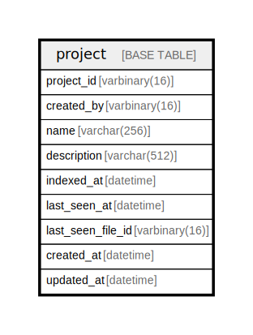

# project

## Description

<details>
<summary><strong>Table Definition</strong></summary>

```sql
CREATE TABLE `project` (
  `project_id` varbinary(16) NOT NULL,
  `created_by` varbinary(16) NOT NULL,
  `name` varchar(256) NOT NULL,
  `description` varchar(512) NOT NULL,
  `indexed_at` datetime NOT NULL DEFAULT current_timestamp(),
  `last_seen_at` datetime NOT NULL DEFAULT current_timestamp(),
  `last_seen_file_id` varbinary(16) NOT NULL,
  `created_at` datetime NOT NULL DEFAULT current_timestamp(),
  `updated_at` datetime NOT NULL DEFAULT current_timestamp() ON UPDATE current_timestamp(),
  PRIMARY KEY (`project_id`),
  KEY `idx_created_by_last_seen_at_desc` (`created_by`,`last_seen_at` DESC,`project_id`),
  KEY `idx_created_by_last_seen_at_asc` (`created_by`,`last_seen_at`,`project_id`)
) ENGINE=InnoDB DEFAULT CHARSET=utf8mb4 COLLATE=utf8mb4_uca1400_ai_ci
```

</details>

## Columns

| Name | Type | Default | Nullable | Extra Definition | Children | Parents | Comment |
| ---- | ---- | ------- | -------- | ---------------- | -------- | ------- | ------- |
| project_id | varbinary(16) |  | false |  |  |  |  |
| created_by | varbinary(16) |  | false |  |  |  |  |
| name | varchar(256) |  | false |  |  |  |  |
| description | varchar(512) |  | false |  |  |  |  |
| indexed_at | datetime | current_timestamp() | false |  |  |  |  |
| last_seen_at | datetime | current_timestamp() | false |  |  |  |  |
| last_seen_file_id | varbinary(16) |  | false |  |  |  |  |
| created_at | datetime | current_timestamp() | false |  |  |  |  |
| updated_at | datetime | current_timestamp() | false | on update current_timestamp() |  |  |  |

## Constraints

| Name | Type | Definition |
| ---- | ---- | ---------- |
| PRIMARY | PRIMARY KEY | PRIMARY KEY (project_id) |

## Indexes

| Name | Definition |
| ---- | ---------- |
| idx_created_by_last_seen_at_asc | KEY idx_created_by_last_seen_at_asc (created_by, last_seen_at, project_id) USING BTREE |
| idx_created_by_last_seen_at_desc | KEY idx_created_by_last_seen_at_desc (created_by, last_seen_at, project_id) USING BTREE |
| PRIMARY | PRIMARY KEY (project_id) USING BTREE |

## Relations



---

> Generated by [tbls](https://github.com/k1LoW/tbls)
