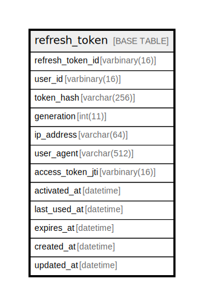

# refresh_token

## Description

<details>
<summary><strong>Table Definition</strong></summary>

```sql
CREATE TABLE `refresh_token` (
  `refresh_token_id` varbinary(16) NOT NULL,
  `user_id` varbinary(16) NOT NULL,
  `token_hash` varchar(256) NOT NULL,
  `generation` int(11) NOT NULL,
  `ip_address` varchar(64) NOT NULL,
  `user_agent` varchar(512) NOT NULL,
  `access_token_jti` varbinary(16) NOT NULL,
  `activated_at` datetime NOT NULL,
  `last_used_at` datetime NOT NULL,
  `expires_at` datetime NOT NULL,
  `created_at` datetime NOT NULL DEFAULT current_timestamp(),
  `updated_at` datetime NOT NULL DEFAULT current_timestamp() ON UPDATE current_timestamp(),
  PRIMARY KEY (`refresh_token_id`)
) ENGINE=InnoDB DEFAULT CHARSET=utf8mb4 COLLATE=utf8mb4_uca1400_ai_ci
```

</details>

## Columns

| Name | Type | Default | Nullable | Extra Definition | Children | Parents | Comment |
| ---- | ---- | ------- | -------- | ---------------- | -------- | ------- | ------- |
| refresh_token_id | varbinary(16) |  | false |  |  |  |  |
| user_id | varbinary(16) |  | false |  |  |  |  |
| token_hash | varchar(256) |  | false |  |  |  |  |
| generation | int(11) |  | false |  |  |  |  |
| ip_address | varchar(64) |  | false |  |  |  |  |
| user_agent | varchar(512) |  | false |  |  |  |  |
| access_token_jti | varbinary(16) |  | false |  |  |  |  |
| activated_at | datetime |  | false |  |  |  |  |
| last_used_at | datetime |  | false |  |  |  |  |
| expires_at | datetime |  | false |  |  |  |  |
| created_at | datetime | current_timestamp() | false |  |  |  |  |
| updated_at | datetime | current_timestamp() | false | on update current_timestamp() |  |  |  |

## Constraints

| Name | Type | Definition |
| ---- | ---- | ---------- |
| PRIMARY | PRIMARY KEY | PRIMARY KEY (refresh_token_id) |

## Indexes

| Name | Definition |
| ---- | ---------- |
| PRIMARY | PRIMARY KEY (refresh_token_id) USING BTREE |

## Relations



---

> Generated by [tbls](https://github.com/k1LoW/tbls)
