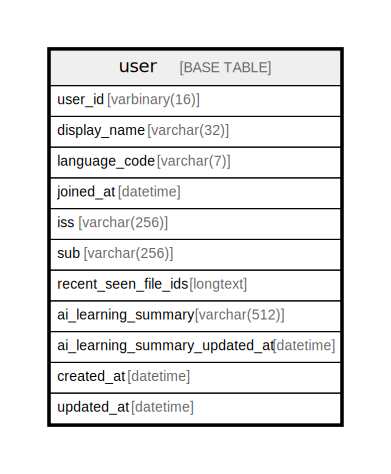

# user

## Description

<details>
<summary><strong>Table Definition</strong></summary>

```sql
CREATE TABLE `user` (
  `user_id` varbinary(16) NOT NULL,
  `display_name` varchar(32) NOT NULL,
  `language_code` varchar(7) NOT NULL,
  `joined_at` datetime NOT NULL,
  `iss` varchar(256) NOT NULL,
  `sub` varchar(256) NOT NULL,
  `recent_seen_file_ids` longtext CHARACTER SET utf8mb4 COLLATE utf8mb4_bin NOT NULL CHECK (json_valid(`recent_seen_file_ids`)),
  `ai_learning_summary` varchar(512) NOT NULL,
  `ai_learning_summary_updated_at` datetime NOT NULL,
  `created_at` datetime NOT NULL DEFAULT current_timestamp(),
  `updated_at` datetime NOT NULL DEFAULT current_timestamp() ON UPDATE current_timestamp(),
  PRIMARY KEY (`user_id`),
  UNIQUE KEY `iss` (`iss`,`sub`)
) ENGINE=InnoDB DEFAULT CHARSET=utf8mb4 COLLATE=utf8mb4_uca1400_ai_ci
```

</details>

## Columns

| Name | Type | Default | Nullable | Extra Definition | Children | Parents | Comment |
| ---- | ---- | ------- | -------- | ---------------- | -------- | ------- | ------- |
| user_id | varbinary(16) |  | false |  |  |  |  |
| display_name | varchar(32) |  | false |  |  |  |  |
| language_code | varchar(7) |  | false |  |  |  |  |
| joined_at | datetime |  | false |  |  |  |  |
| iss | varchar(256) |  | false |  |  |  |  |
| sub | varchar(256) |  | false |  |  |  |  |
| recent_seen_file_ids | longtext |  | false |  |  |  |  |
| ai_learning_summary | varchar(512) |  | false |  |  |  |  |
| ai_learning_summary_updated_at | datetime |  | false |  |  |  |  |
| created_at | datetime | current_timestamp() | false |  |  |  |  |
| updated_at | datetime | current_timestamp() | false | on update current_timestamp() |  |  |  |

## Constraints

| Name | Type | Definition |
| ---- | ---- | ---------- |
| iss | UNIQUE | UNIQUE KEY iss (iss, sub) |
| PRIMARY | PRIMARY KEY | PRIMARY KEY (user_id) |
| recent_seen_file_ids | CHECK | CHECK (json_valid(`recent_seen_file_ids`)) |

## Indexes

| Name | Definition |
| ---- | ---------- |
| PRIMARY | PRIMARY KEY (user_id) USING BTREE |
| iss | UNIQUE KEY iss (iss, sub) USING BTREE |

## Relations



---

> Generated by [tbls](https://github.com/k1LoW/tbls)
